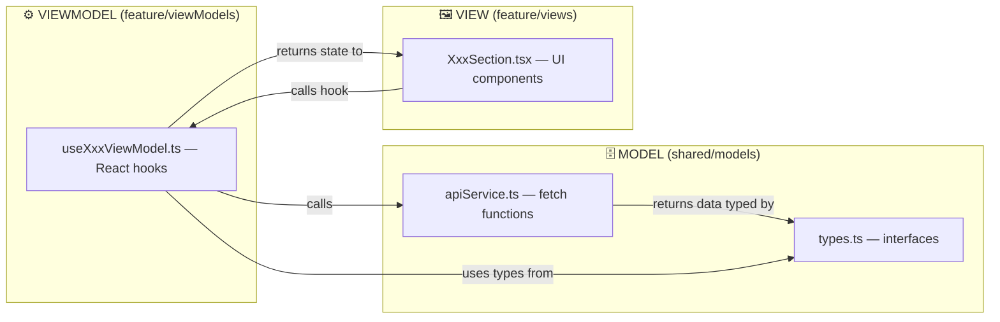

# ElGibhor MVVM Architecture Guide

> [!NOTE]
> This document explains the **Model-View-ViewModel (MVVM)** architecture used in the ElGibhor-website-ui project — a Vite + React + TypeScript app. Use this as a reference when prompting Antigravity (or any AI) to scaffold a new project with the same structure.

---

## Full Folder Tree

```
src/
├── main.tsx                          # App bootstrap (renders <App />)
├── App.tsx                           # Router + layout shell
├── index.css                         # Global styles
│
├── models/                           # ⛔ LEGACY — duplicated, see shared/models
│   ├── types.ts
│   └── apiService.ts
│
├── viewModels/                       # ⛔ LEGACY — duplicated, see feature-level viewModels
│   ├── useHomeViewModel.ts
│   └── useMinistriesViewModel.ts
│
├── shared/                           # 🔵 Cross-cutting concerns (used by ALL features)
│   ├── models/                       #    Data layer (types + API services)
│   │   ├── types.ts                  #    TypeScript interfaces / types
│   │   └── apiService.ts             #    API calls / data fetching functions
│   ├── hooks/                        #    Reusable React hooks
│   │   ├── useMediaQuery.ts
│   │   ├── useMousePosition.ts
│   │   └── useDeviceOrientation.ts
│   ├── utils/                        #    Pure utility functions / constants
│   │   └── animations.ts            #    Framer Motion animation presets
│   └── components/                   #    Shared UI components
│       ├── Navbar.tsx
│       ├── Footer.tsx
│       ├── GlobalBackground.tsx
│       ├── PlanVisitModal.tsx
│       ├── PremiumCard.tsx
│       ├── ScrollToTop.tsx
│       ├── ScrollManager.tsx
│       ├── SmoothScroller.tsx
│       ├── CustomCursor.tsx
│       ├── MagneticButton.tsx
│       ├── AdminHeader.tsx
│       └── AdminSidebar.tsx
│
└── features/                         # 🟢 Feature modules (one per page/domain)
    ├── home/
    │   ├── viewModels/
    │   │   └── useHomeViewModel.ts   #    ViewModel hook for Home
    │   └── views/
    │       ├── Home.tsx              #    Page-level container (composes sections)
    │       ├── HeroSection.tsx       #    Section component (View)
    │       ├── WelcomeGrid.tsx       #    Section that consumes useHomeViewModel
    │       ├── StrategyCards.tsx
    │       ├── WelcomeVideo.tsx
    │       ├── WhatToExpect.tsx
    │       └── PlanVisitForm.tsx
    │
    ├── about/
    │   └── views/
    │       ├── AboutUs.tsx
    │       └── DaughterChurchesSection.tsx
    │
    ├── ministries/
    │   ├── viewModels/
    │   │   └── useMinistriesViewModel.ts
    │   └── views/
    │       └── Ministry.tsx
    │
    ├── engage/
    │   └── views/ ...
    ├── experience/
    │   └── views/ ...
    ├── give/
    │   └── views/ ...
    ├── watch/
    │   └── views/ ...
    ├── prayer/
    │   └── views/ ...
    ├── connect/
    │   └── views/ ...
    ├── contact/
    │   └── views/ ...
    ├── services/
    │   └── views/ ...
    └── Admin/
        ├── Login.tsx
        ├── AdminDashboard.tsx
        ├── AdminEvents.tsx
        └── registrations/
            └── AdminRegistrations.tsx
```

---

## The Three MVVM Layers



### 1. Model — `shared/models/`

The **data layer**. Defines _what the data looks like_ and _how to get it_.

| File | Role |
|---|---|
| `types.ts` | TypeScript interfaces (`Ministry`, etc.) |
| `apiService.ts` | Async functions that fetch data (currently mock, swappable for real API) |

```typescript
// shared/models/types.ts
export interface Ministry {
  id: string;
  title: string;
  description: string;
  imageUrl: string;
}
```

```typescript
// shared/models/apiService.ts
import type { Ministry } from './types';

const mockMinistries: Ministry[] = [ /* ... */ ];

export const fetchMinistries = async (): Promise<Ministry[]> => {
  return new Promise((resolve) => setTimeout(() => resolve(mockMinistries), 800));
};
```

> [!TIP]
> The Model layer is completely **framework-agnostic** — no React, no hooks, no JSX. This makes it easy to swap out for a real backend later.

---

### 2. ViewModel — `features/<name>/viewModels/`

The **logic bridge**. Custom React hooks (`use___ViewModel`) that:
- Call the Model's API functions
- Manage React state (`useState`, `useEffect`)
- Expose a **clean return object** of state + actions to Views

```typescript
// features/home/viewModels/useHomeViewModel.ts
import { useState, useEffect } from 'react';
import type { Ministry } from '../../../shared/models/types';
import { fetchMinistries } from '../../../shared/models/apiService';

export const useHomeViewModel = () => {
  const [ministries, setMinistries] = useState<Ministry[]>([]);
  const [isLoading, setIsLoading] = useState<boolean>(true);
  const [error, setError] = useState<string | null>(null);

  useEffect(() => {
    const loadData = async () => {
      try {
        setIsLoading(true);
        const data = await fetchMinistries();
        setMinistries(data);
      } catch (err) {
        setError('Failed to load ministries data.');
      } finally {
        setIsLoading(false);
      }
    };
    loadData();
  }, []);

  return { ministries, isLoading, error };
  //       ↑ state     ↑ state    ↑ state — all consumed by Views
};
```

> [!IMPORTANT]
> **Each feature gets its own ViewModel**, even if two features fetch the same data. This keeps concerns isolated — the Home page's ViewModel might slice only 4 ministries, while the Ministries page shows all of them.

---

### 3. View — `features/<name>/views/`

The **UI layer**. Pure presentation + layout. Views:
- Call their feature's ViewModel hook
- Render JSX using the returned state
- Handle **only** UI-local state (hover, expanded, etc.)

```typescript
// features/ministries/views/Ministry.tsx
import { useMinistriesViewModel } from '../viewModels/useMinistriesViewModel';

export const Ministry: React.FC = () => {
  const { ministries, isLoading } = useMinistriesViewModel();
  //       ↑ comes from ViewModel

  const [expandedId, setExpandedId] = useState<string | null>(null);
  //     ↑ UI-only state (not in ViewModel)

  return ( /* render ministries using the state */ );
};
```

**Page-level Views** (`Home.tsx`) compose multiple section components:

```typescript
// features/home/views/Home.tsx
export const Home: React.FC = memo(() => (
  <div>
    <HeroSection />       {/* purely visual */}
    <WelcomeGrid />       {/* calls useHomeViewModel internally */}
    <StrategyCards />
    <WelcomeVideo />
    <WhatToExpect />
    <PlanVisitForm />
  </div>
));
```

---

## Data Flow Summary

```
User visits /ministries
       │
       ▼
  App.tsx (Router)
       │  lazy(() => import('./features/ministries/views/Ministry'))
       ▼
  Ministry.tsx (VIEW)
       │  const { ministries, isLoading } = useMinistriesViewModel()
       ▼
  useMinistriesViewModel.ts (VIEWMODEL)
       │  calls fetchMinistries() from shared/models/apiService
       ▼
  apiService.ts (MODEL)
       │  returns Ministry[] (typed by shared/models/types.ts)
       ▼
  Data flows back up: MODEL → VIEWMODEL state → VIEW renders
```

---

## Shared Layer — `shared/`

Cross-cutting code that **any** feature can import:

| Folder | Purpose | Examples |
|---|---|---|
| `shared/models/` | Types + API service | `types.ts`, `apiService.ts` |
| `shared/hooks/` | Reusable React hooks | `useMediaQuery`, `useMousePosition` |
| `shared/utils/` | Pure functions / constants | `animations.ts` (Framer Motion presets) |
| `shared/components/` | Global UI components | `Navbar`, `Footer`, `PlanVisitModal`, `PremiumCard` |

---

## Key Conventions

| Convention | Detail |
|---|---|
| **ViewModel = custom hook** | Named `use<Feature>ViewModel.ts`, returns `{ state, actions }` |
| **Views never call APIs directly** | Always go through a ViewModel hook |
| **Feature isolation** | Each feature folder is self-contained with its own `views/` and `viewModels/` |
| **Lazy loading** | All page-level views are `lazy()` loaded in `App.tsx` |
| **Shared = global** | Anything used by 2+ features lives in `shared/` |
| **UI-only state stays in View** | Hover states, expanded IDs, active indexes — local `useState` in the component |
| **Business/data state lives in ViewModel** | Loading, error, fetched data — all in the `useXxxViewModel` hook |

---

## Prompt Template for New Projects

Copy-paste this into a new Antigravity conversation to bootstrap a project with the same architecture:

````
make this project using the MVVM architecture with this folder structure:

src/
├── main.tsx
├── App.tsx
├── index.css
├── shared/
│   ├── models/
│   │   ├── types.ts          # All TypeScript interfaces
│   │   └── apiService.ts     # All API/data fetching functions
│   ├── hooks/                # Reusable React hooks (useMediaQuery, etc.)
│   ├── utils/                # Pure utility functions and constants
│   └── components/           # Global components (Navbar, Footer, etc.)
└── features/
    └── <feature-name>/
        ├── viewModels/
        │   └── use<Feature>ViewModel.ts   # Custom hook: calls Model, manages state
        └── views/
            ├── <Feature>.tsx              # Page container (composes sections)
            └── <Section>.tsx              # Individual section components

Rules:
1. MODEL (shared/models/): Types + API functions. No React code here.
2. VIEWMODEL (features/<name>/viewModels/): Custom React hooks named use<Feature>ViewModel. 
   Calls Model layer, manages useState/useEffect, returns { data, isLoading, error }.
3. VIEW (features/<name>/views/): React components. Calls ViewModel hooks for data. 
   Only manages UI-local state (hover, expanded, etc.) directly.
4. Views NEVER call API functions directly — always go through a ViewModel.
5. Shared code used by 2+ features goes in shared/.
6. Each page component is lazy-loaded in App.tsx.
7. Use Framer Motion for animations, React Router for routing.
8. Use TailwindCSS for styling.

````

> [!TIP]
> Replace `[LIST YOUR FEATURES HERE]` with your pages, e.g. `home, about, products, contact`. Antigravity will scaffold the full tree with proper imports.
